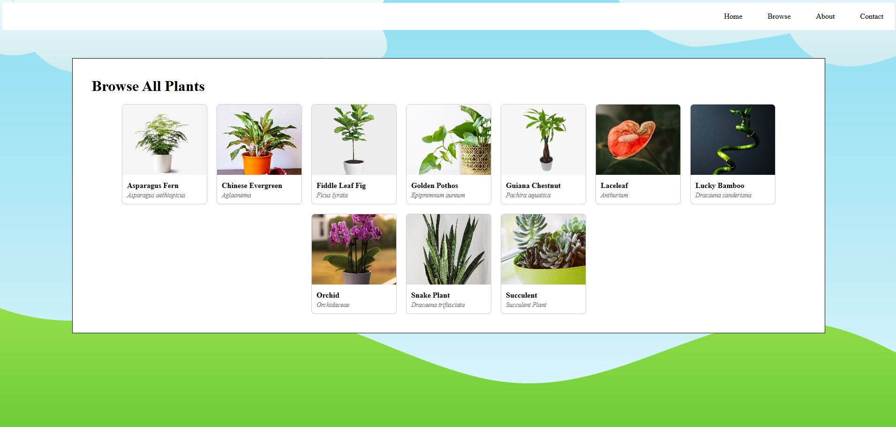

# Houseplant Care App

A Java web application that lets users search for houseplants and view care instructions  
including watering frequency, sunlight requirements, and plant descriptions.

## Tech Stack

- **Backend:** Java 17, Spring Boot 3, Spring MVC
- **Templating:** Thymeleaf
- **Database:** MySQL 8, Spring Data JPA (Hibernate)
- **Build:** Apache Maven

## Features

- Search for plants by name (partial and case-insensitive)
- Browse all available plants in a card grid
- View care details for each plant: watering schedule, sunlight needs, and a description
- Add, edit, and delete plants




## Prerequisites

- JDK 17 or higher
- Apache Maven
- MySQL 8

## Setup

**1. Clone the repository**
  ```
  git clone https://github.com/h-ordonez/plant-care-app.git
  cd PlantCareApp
  ```

**2. Import the database**

In MySQL, run the included dump file to create and populate the `plants_db` database:
  ```
  mysql -u root -p < plants_db_20200731.sql
  ```

**3. Configure database credentials**
  ```
  cp PlantCareApp/src/main/resources/application.properties.example \
     PlantCareApp/src/main/resources/application.properties
  ```
Open `application.properties` and fill in your MySQL username and password.

**4. Build and run**
  ```
  cd PlantCareApp
  mvn spring-boot:run
  ```

Then navigate to the following in your web browser:
  ```
  http://localhost:8080/
  ```

## Project Structure

  ```
  PlantCareApp/
  ├── src/main/
  │   ├── java/com/plantcareapp/
  │   │   ├── model/Plant.java                # JPA entity mapped to the plants table in DB
  │   │   ├── controller/PlantController.java # Spring MVC controller
  │   │   ├── repository/PlantRepository.java # Spring Data JPA repository
  │   │   └── PlantCareAppApplication.java    # Spring Boot entry point
  │   └── resources/
  │       ├── static/
  │       │   ├── Images/
  │       │   └── styles.css
  │       ├── templates/
  │       │   ├── fragments/nav.html
  │       │   ├── about.html
  │       │   ├── contact.html
  │       │   ├── index.html                  # Home page
  │       │   ├── missing-plant.html
  │       │   ├── output.html                 # Plant details page
  │       │   ├── plant-form.html             # Add/Edit plant form
  │       │   ├── plants.html                 # Browse all plants
  │       │   └── search.html
  │       └── application.properties.example  # Database config template
  ├── plants_db_20200731.sql                  # Database seed file
  └── pom.xml
  ```

